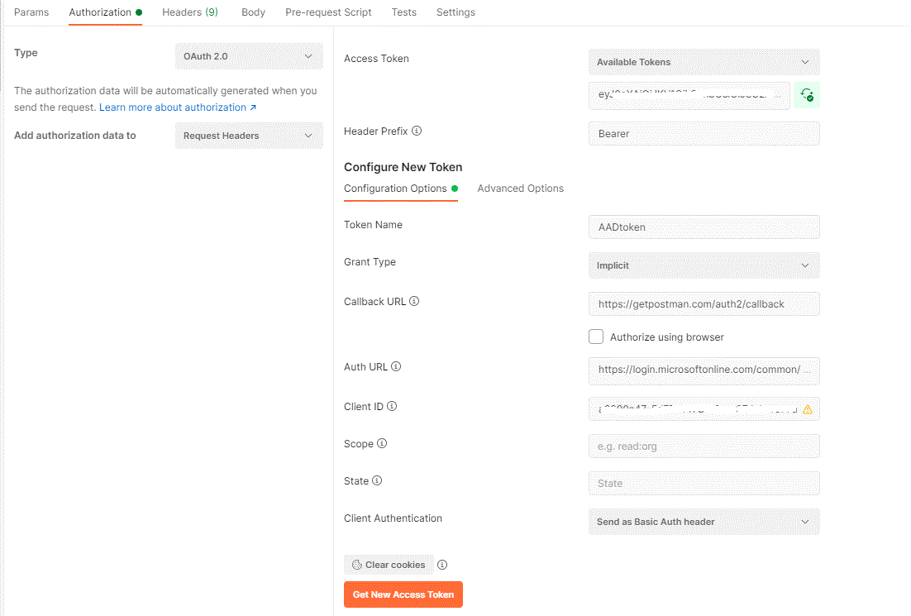

# Setup Azure AD application in Business Central

This folder contains 4 samples for different OAuth flows to acquire token to access Business Central:

* Acquire token as Application
* Acquire token with Resource Owner Password Credentials
* Acquire token by authorization Code
* Acquire token interactively

In order to access **Business Central Automation API**, it is required to **[Setup Azure AD application in Business Central](https://docs.microsoft.com/en-us/dynamics365/business-central/dev-itpro/administration/automation-apis-using-s2s-authentication#task-2-set-up-the-azure-ad-application-in-)** .

## **Azure AD Application** registration:

1. Sign into azure portal under tenant admin user, go to **'Azure Active Directory'** - **'App registrations'**

2. Click **'+ New registration'**. Provide a **'Name'** for application, set **'Supported account types'** to **"Accounts in this organizational directory only"**. Click **'Register'** button.

3. Setup API permissions for newly created application, go to **'API permissions'**:
    * In order to acquire tokens as application (used for automation APIs), add: **'Dynamics 365 Business Central'** - **'Application permissions'** - **'Automation.ReadWrite.All'**
    * In order to acquire tokens as user, i.e. impersonate somebody (used to call BC web services), add: **'Dynamics 365 Business Central'** - **'Delegated permissions'** - **'Financials.ReadWrite.All'**

4. After permissions are added, click **'Grant admin consent for ...'**. Status in the table of permissions shoud change to **'Granted'**

5. Setup client secret (used in authorization code flow scenario and application scenario):
    * Go to **'Certificates & secrets'** - **'Client secrets'**, click **'+ New client secret'**
    * Add some description, choose **'Expires'** setting and click **'Add'**
    * After secret is created, copy secret **'Value'** and save for later.

6. Setup Redirect Uris:
    * For authorization code flow it is required to setup redirect Uri for web platform. Go to **'Authentication'** - **'Platform configurations'**, click **'+ Add a platform'**. Choose **'Web'**, enter **`'https://getpostman.com/auth2/callback'`** as redirect Uri. Click **'Configure'**.
    * For interactive and ROPC flows it is required to setup redirect Uri for mobile and desktop platform. Go to **'Authentication'** - **'Platform configurations'**, click **'+ Add a platform'**. Choose **'Mobile and desktop applications'**, click to switch on **'... (MSAL only)'** redirect Uri. Click **'Configure'**.

7. In order to use Resource Owner Password Credential flow, allow public client flows. Go to **'Authentication'** - **'Advanced settings'**, and set **'Allow public client flows'** to **'Yes'**. Click **'Save'** button at the top.

## **Postman Setup**:

Parameter | Value |
--- | --- |
Grant Type | Implicit |
Callback URL | https://getpostman.com/auth2/callback |
Auth URL | https://login.microsoftonline.com/common/oauth2/authorize?resource=https://api.businesscentral.dynamics.com |
Client ID | Azure App Registration ID |
