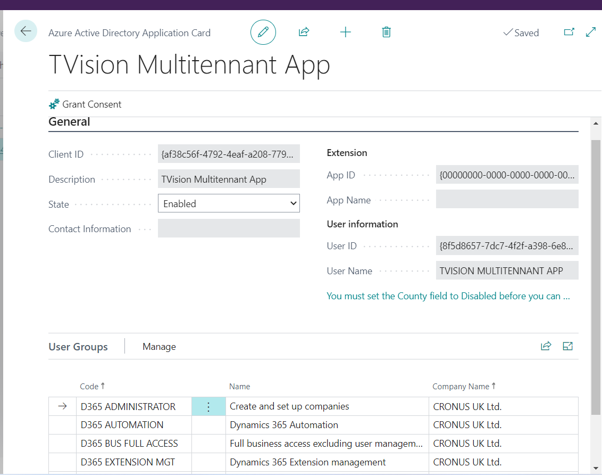
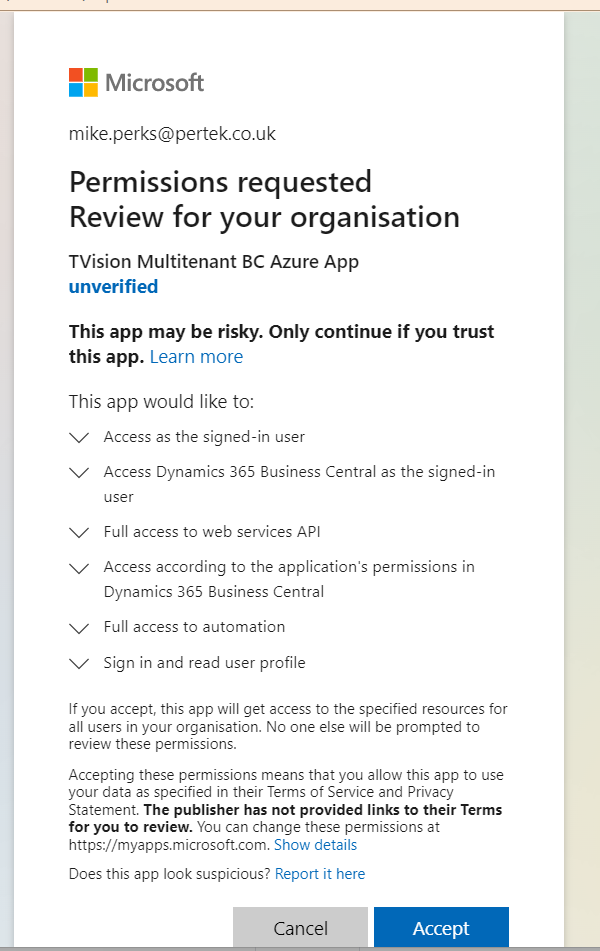

# Microsoft Business Central Azure Acitve Directory Applications

## Steps 1 Create Azure Active Application Record

1. Access Business Central and search for "Azure Active Directory Applications".
2. Create a new Record.
3. Populate Field "Client ID"  with value "af38c56f-4792-4eaf-a208-779cc4210d63".
4. Populate Field "Description" with value "TVision Multitenant App".
5. Add Permissions User Groups
    - D365 Automation
    - D365 Extension Mgt
    - D365 Bus Full Access
    - D365 Administration

## Steps 2 Create Azure Active Application Record

1. Same Page  "Azure Active Directory Application Card".
2. Press button "Grant Consent".
3. it will then get pop up a browser page and ask for credentials M365.
4. Login with account within the tenant and grant all permissions.
5. Press "Accept".

